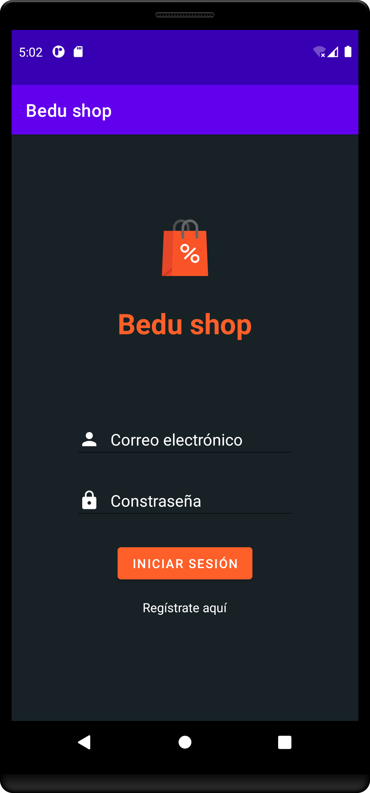

[`Kotlin Intermedio`](../../Readme.md) > [`Sesión 01`](../Readme.md) > `Proyecto`

## Proyecto: Lineamientos 

### 1. Objetivos :dart:

- Definir el proyecto con el que trabajaremos todo el curso.
- Interpretar los lineamientos que integra el proyecto.
- Programar la idea básica de nuestra aplicación.

### 2. Requisitos :clipboard:

1. Android Studio Instalado en nuestra computadora.

### 3. Desarrollo :computer:

En esta primera parte del curso, debemos definir un proyecto con el que trabajemos las 8 sesiones. Este proyecto va ir tomando mayor complejidad conforme se vaya avanzando en nuevos temas, obteniendo herramientas que nos permitan realizar nuevas funcionalidades.

##### Definición del proyecto

Crearemos una aplicación para una tienda en línea llamada Bedu Shop, que simulará ser un e-commerce donde podremos iniciar sesión, visualizar una lista de productos, añadir elementos a un carrito de compras o simular una compra.

La dificultad de implementación para cada tema varía de acuerdo a la complejidad de este, e incluso hay sesiones en las que no habrá implementación de sesión al proyecto.

####  lineamientos para comenzar el proyecto

- La aplicación está pensada únicamente para teléfonos móviles y con orientación vertical, esto para reducir complejidad y ahorrar tiempo en los diseños de layouts.
- Se evaluarán únicamente las implementaciones de los temas vistos en el curso, cualquier implementación extra no tiene un impacto significativo en la calificación final. 

#### Implementación de la sesión

Para comenzar, crearemos un nuevo proyecto vacío y dentro de él definiremos una pantalla de login, dicha interfaz debe ser alojada en un ___LoginActivity___.

##### Interfaz

Login elaborado con un ***LinearLayout\*** que tenga: ******

- Imagen del logo

- Input correo (input type email)

- Input Contraseña (input type password)

- Texto Registrarse (en formato vínculo)

- Botón Login

  

##### Lógica

- Al hacer click sobre el botón de login, debe aparecer un Error con el parámetro faltante bajo cada EditText. 
- Si los inputs están llenos, Mostrar un Toast con el mensaje "Inicio de sesión exitoso" (esta medida será temporal ).

La interfaz debe quedar de la siguiente forma:

#### Recursos

* [Imagen de cabecera ](../resources/ic_shopping_bag.xml)

* Colores:

  *   Color del botón y el título: ***f03c15***
  *  Color del background: ***#172126***

[`Anterior`](../Reto-01/Readme.md) | [`Siguiente`](../Readme.md)

