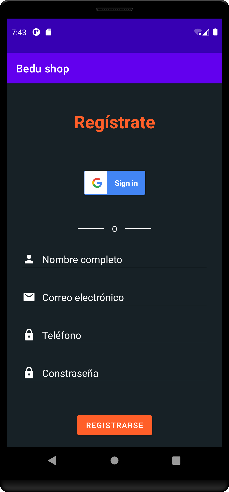

[`Kotlin Intermedio`](../../Readme.md) > [`Sesión 02`](../Readme.md) > `Proyecto`

## Proyecto: Activities y Layouts

<div style="text-align: justify;">

### 1. Objetivos :dart:

- Crear un flujo entre Activities.
- Diseñar los layouts de las _Activities_ con ___ConstraintLayout___.

### 2. Requisitos :clipboard:

1. Android Studio Instalado en nuestra computadora.

### 3. Desarrollo :computer:

En este reto final, vamos a crear una pantalla de registro que esté conectada con el inicio de sesión.


#### Lineamientos


##### Interfaz

* _Viewgroup_ de la clase ___ConstraintLayout___.

- Título "Registrarse" como cabecera

- Botón de inicio de sesión en google (Este no implementará ninguna funcionalidad) 

- Input de nombre ( con input type de nombre de persona)

- Input de e-mail ( con input type de email)

- Input de número telefónico (con input type de phone)

- Input Contraseña (con input type de password)

- Botón de registrarse.

  

  

##### Lógica

- Al hacer click sobre el botón login, Navegar a un menú principal ()
- Al hacer click sobre registro, enviar al activity de register.
- Al registrar todos los datos satisfactoriamente, regresar al menú de inicio


La interfaz debe quedar de la siguiente forma:





#### Recursos

* Para aprender a implementar de login con google, consultar[Este enlace](https://developers.google.com/identity/sign-in/android/sign-in) lleva a la documentación del View. 
* El color del botón de google cambia a azul al utilizar este atributo: ```app:colorScheme="dark"```
* Colores:

  *   Color del botón y el título: ***f03c15***
  *  Color del background: ***#172126***

[`Anterior`](../Ejemplo-05/Readme.md) | [`Siguiente`](../Readme.md)

</div>
