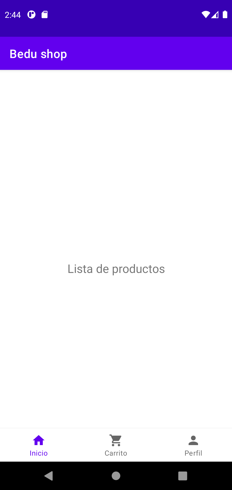
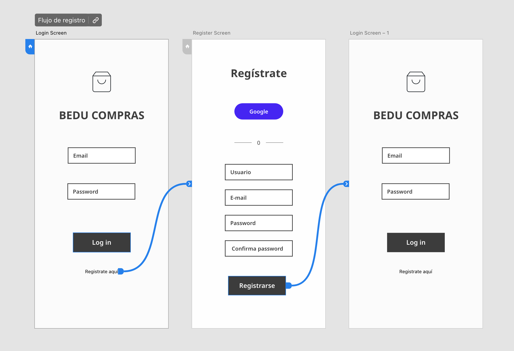
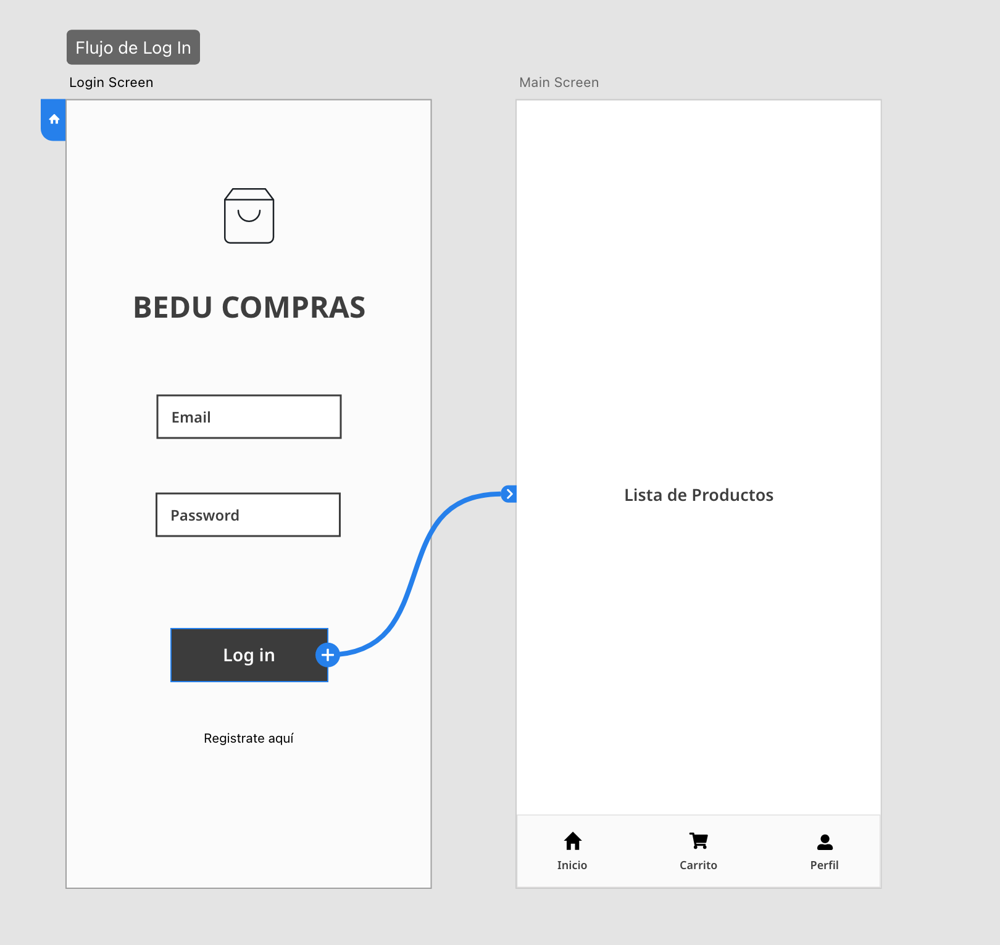
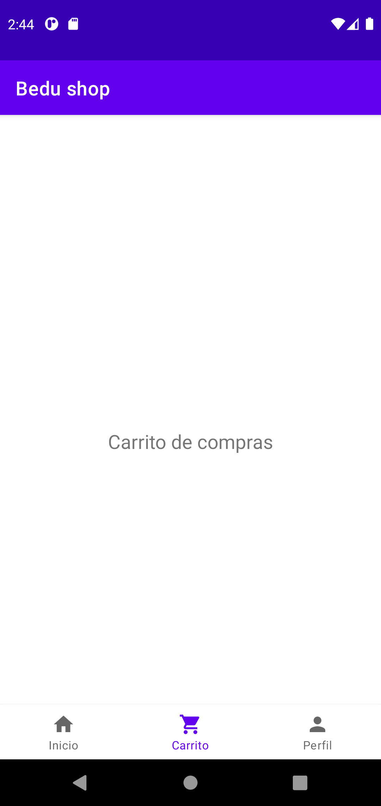
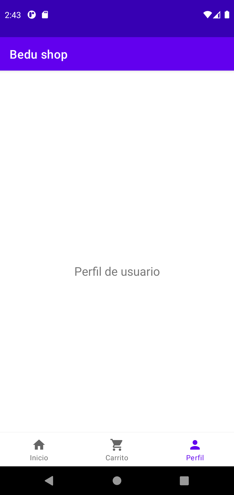
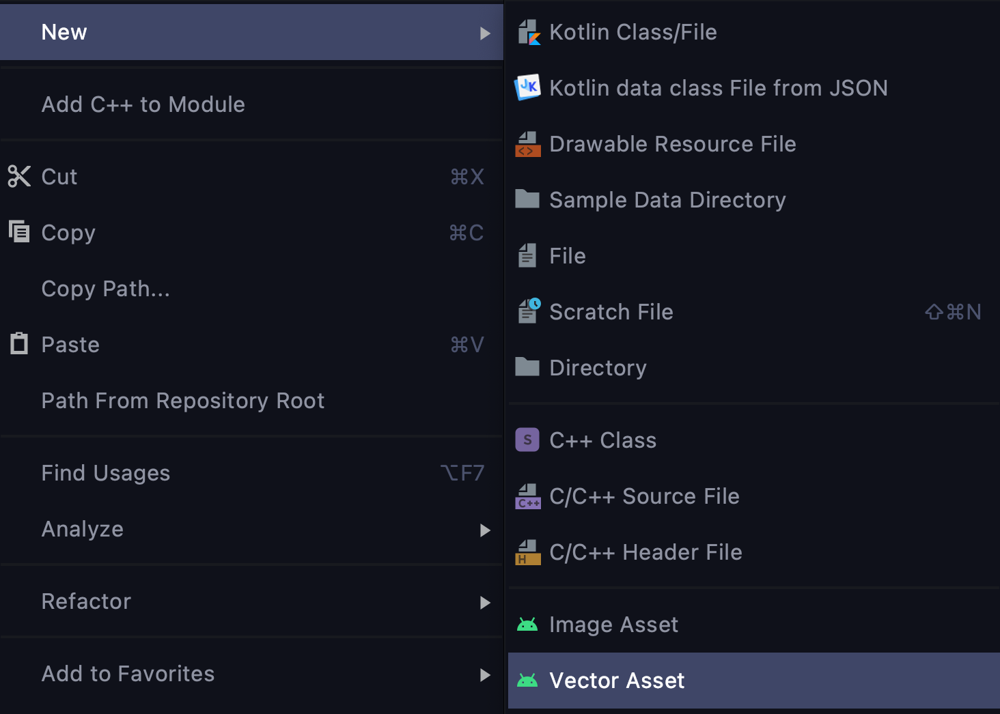

* [`Kotlin Intermedio`](../../Readme.md) > [`Sesión 04`](../Readme.md) > `Proyecto`

  ## Proyecto: Navigation

  <div style="text-align: justify;">


  ### 1. Objetivos :dart:

  * Adaptar el código de un proyecto Android para el envío de argumentos de manera segura mediante SafeArgs.

  * Implementar una navegación en un proyecto Android a partir de menús y paneles.

    

  ### 2. Requisitos :clipboard:

  1. Android Studio Instalado en nuestra computadora.

### 3. Desarrollo :computer:


En esta parte del proyecto, crearemos una navegación en nuestro proyecto utilzando ___Navigation Component___, que va a reemplazar el uso de ___startActivity___ en nuestro proyecto. Para esto, necesitaremos trasladar nuestras vistas a distintos fragments que generen la navegación.





### Interfaz

La interfaz la describiremos mediante dos flujos que describen la navegación.


##### Flujo de registro




En este flujo, navegaremos a la pantalla de registro cuando pulsemos sobre el link de ___Regístrate aquí___. Posteriormente, registraremos nuestros datos y al finalizar, pulsaremos sobre el botón de registrar, que nos hará navegar a la pantalla de inicio de sesión.


##### Flujo de login




En este flujo, el botón de inicio de sesión nos llevará a la pantalla principal, la cual desplegará una barra de navegación (___BottomNavigationView___). Cada pestaña nos llevará a un Fragment en específico que contendrá un texto en particular, que en otras sesiones reemplazaremos por contenido adecuado.


##### Pantallas

  


Las pantallas de registro y de login serán las mismas que desarrollamos en las sesiones previas. La pantalla principal debe tener las siguientes pestañas, que al dar click sobre ellas debe verse como se muestra arriba.


##### Resultado final


### Lineamientos

- Al hacer click sobre el botón login, Navegar a un menú principal.
- Al hacer click sobre registro, enviar al activity de register.
- Al registrar todos los datos satisfactoriamente, regresar al menú de inicio


### Recursos

* La barra inferior con las pestañas es un componente llamado  ___BottomNavigationView___ y se implementa de la sig. forma:

  ```xml
   <com.google.android.material.bottomnavigation.BottomNavigationView
   		 ...                                                                 
       android:layout_height="56dp"
       android:layout_gravity="start"
       app:menu="@menu/my_navigation_items" />
  ```

Donde el recurso ___app:menu___ es un recurso xml con varios pares ícono-título. 

* Los íconos se pueden obtener del ***Vector Asset Studio***, para esto, damos click derecho en nuestro _resource directory_ (en este caso _drawables_), y luego ___new > Vector Asset___. 

  

Saldrá una ventana en la que podrán seleccionar uno de una lista de íconos, y al finalizar, se generará un xml con el recurso como vector.


[`Anterior`](../Reto-02/Readme.md) | [`Siguiente`](../Reto-03/Readme.md)
