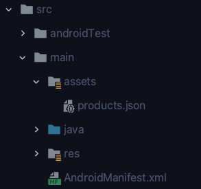
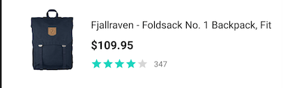
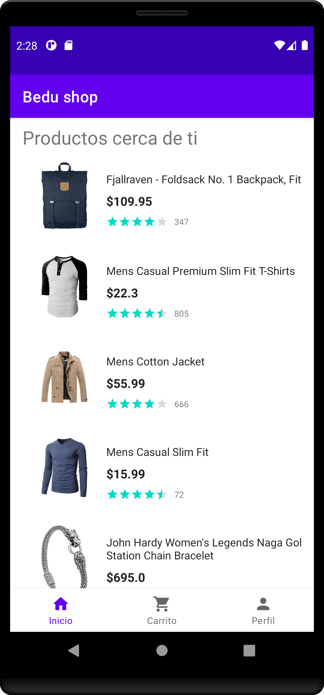
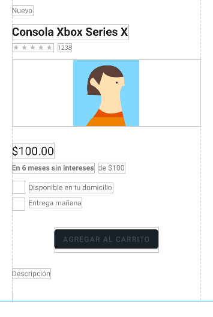
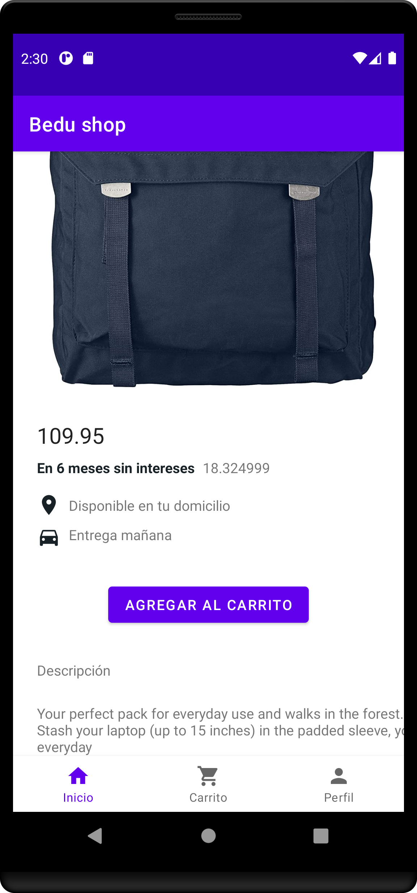
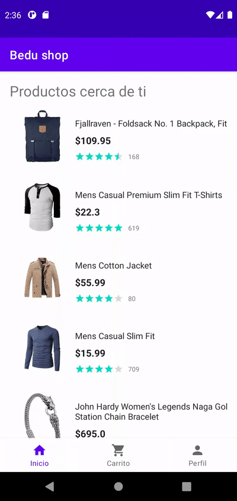

[`Kotlin Intermedio`](../../Readme.md) > [`Sesión 05`](../Readme.md) > `Proyecto`

## Proyecto: Listas

<div style="text-align: justify;">

### 1. Objetivos :dart:

- Aplicar el conocimiento de Listas a nuestro proyecto.

### 2. Requisitos :clipboard:

1. Android Studio Instalado en nuestra computadora.
2. Seguir la instrucción específica para esta sesión.

### 3. Desarrollo :computer:

Las listas son elementos recurrentes en las aplicaciones. En nuestra aplicación de galería, tenemos un grid de fotos que al pulsar sobre un elemento, se despliega la imagen para abarcar toda la pantalla. En una app bancaria, el historial de transacciones se muestran en lista. Para una app de cine, las películas están listadas de forma vertical. 


#### Lista de datos

Para mayor simplicidad y para mantener un código limpio, obtendremos los datos de un archivo json alojado en local. El JSON consiste en un arreglo de objetos con los siguientes datos:

* **id**: Número entero que sirve como identificador.
* **title**: Título del producto.
* **price**: número flotante que indica el precio. 
* **description**: cadena de texto que da una descripción del producto.
* **category**: string que categoriza al producto.
* **image**: texto que contiene la URL de la imagen del producto.

A continuación se muestra una fracción del JSON:

```json
[
    {
        "id": 1,
        "title": "Fjallraven - Foldsack No. 1 Backpack, Fits 15 Laptops",
        "price": 109.95,
        "description": "Your perfect pack for everyday use and walks in the forest. Stash your laptop (up to 15 inches) in the padded sleeve, your everyday",
        "category": "men's clothing",
        "image": "https://fakestoreapi.com/img/81fPKd-2AYL._AC_SL1500_.jpg"
    },
  {
        "id": 2,
        "title": "Mens Casual Premium Slim Fit T-Shirts ",
        "price": 22.3,
        "description": "Slim-fitting style, contrast raglan long sleeve, three-button henley placket, light weight & soft fabric for breathable and comfortable wearing. And Solid stitched shirts with round neck made for durability and a great fit for casual fashion wear and diehard baseball fans. The Henley style round neckline includes a three-button placket.",
        "category": "men's clothing",
        "image": "https://fakestoreapi.com/img/71-3HjGNDUL._AC_SY879._SX._UX._SY._UY_.jpg"
    },
  ...
  }
]
```


El archivo json se obtiene mediante el método ___getProducts___, definido en el siguiente bloque de código, donde el método ___getJsonDataFromAsset___ sirve para obtener los datos del JSON en formato __String__.

```kotlin
private fun getJsonDataFromAsset(context: Context, fileName: String = "products.json"): String? {
        val jsonString: String
        try {
            jsonString = context.assets.open(fileName).bufferedReader().use { it.readText() }
        } catch (ioException: IOException) {
            ioException.printStackTrace()
            return null
        }
        return jsonString
    }

    fun getProducts(context: Context): List<Product> {
        val jsonString = getJsonDataFromAsset(context)
        val listProductType = object : TypeToken<List<Product>>() {}.type
        return Gson().fromJson(jsonString, listProductType)
    }
```


El archivo debe estar alojado en el directorio ___assets___, que crearemos dentro del directorio ***main***.




El archivo se encuentra a nivel de este readme, y se obtiene mediante [este enlace](./products.json). 

#### Lista de productos

El fragmento relacionado con la pestaña de inicio deberá alojar un ___RecyclerView___ donde se despliegue la lista de productos recuperada mediante el método ___getProducts___. 

cada elemento de nuestra lista debe tener un layout que de el siguiente resultado: 



En este elemento podemos observar un *View* con cinco estrellas y a su derecha, un número; estos representan la calificación del producto y el número de calificaciones respectivamente. Estos datos no están dentro del JSON, por lo que lo generaremos de manera aleatoria.


La lista de productos debe verse así:




#### Detalle del producto

Al dar click sobre algún elemento de la lista, la app deberá dirigirnos al detalle del producto, que se desplegará de la siguiente forma:



Como ejemplo, la pantalla se verá así:




Al dar click sobre el botón __Agregar carrito__, nos debe llevar a la pestaña de carrito.


#### Resultado final



### Recursos

* El ___View___ para desplegar la calificación mediante estrellas se llama ___RatingBar___, y se utiliza de la siguiente forma:

  ```xml
  <RatingBar
     ...
      style="@android:style/Widget.Material.RatingBar.Small"
      android:layout_width="wrap_content"
      android:layout_height="wrap_content"
     />
  ```

  Donde el estilo determina el tamaño de las estrellas.

* [Este enlace](./products.json) nos lleva al archivo JSON para la lista de productos.

* Los íconos de gps y vehículo en la pantalla de detalle, se obtienen del vector asset studio.

[`Anterior`](../Reto-03/Readme.md) | [`Siguiente`](../Readme.md)


</div>
