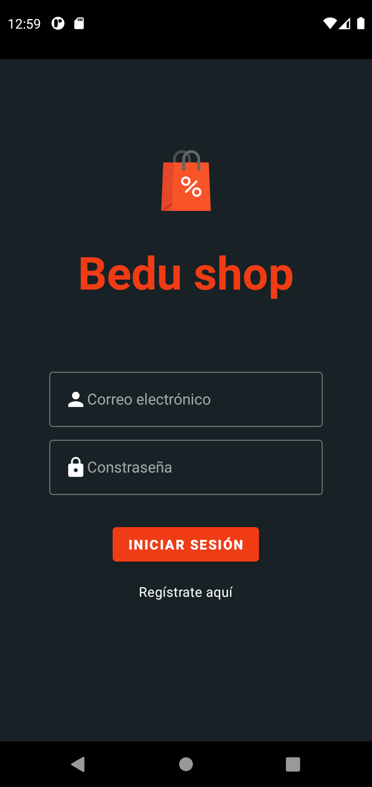
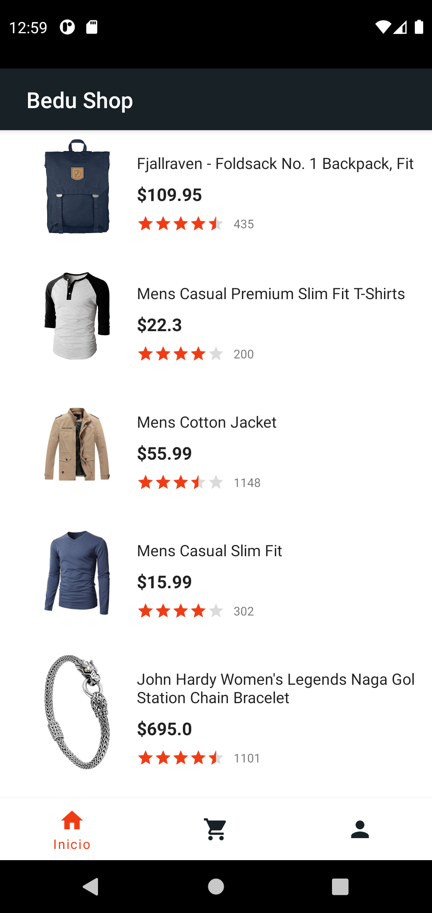

[`Kotlin Intermedio`](../../Readme.md) > [`Sesión 06`](../Readme.md) > `Proyecto`

## Proyecto: Material Design

### 1. Objetivos :dart:

- Personalizar el tema y estilo del layout mediante _Themes_ y _Components_ de Material Design.

### 2. Requisitos :clipboard:

1. Android Studio Instalado en nuestra computadora.

### 3. Desarrollo :computer:

Para apegarnos más a los estándares de google y crear una aplicación con un diseño intuitivo, implementaremos los temas de _Material Design_ que pudimos abarcar durante esta sesión. Esto implica reemplazar todos los _Views_ que tengan un equivalente en ___MaterialComponents___.

#### Components

Debemos reemplazar todos los elementos posibles por su equivalente en material componente, algunos de estos son:

* Buttons
* EditText (Implementando un TextInputLayout outlined)

#### Themes

El tema a implementar utiliza los siguientes colores:

*  Color primario: ***#172126***
*   Color secundario: ***f03c15***

Nótese que en el caso de los botones, a pesar de utilizar el color negro como color primario, estamos utilizando el secundario para rellenar el botón de inicio de sesión. Los inputs tienen un contorno blanco para distinguirse del fondo. Adicionalmente, no tenemos App Bar para esta pantalla. 

Los casos anteriores se aplican para el registro.

En el caso del menú principal, el color de un elemento del BottomNavigation seleccionado será de color naranja, mientras que en su estado normal es color negro. El texto solo se muestra cuando está seleccionado, esto es **opcional**.

### Herramientas de apoyo:

* [Guía de aplicación de colores de Material Design](https://material.io/design/color/applying-color-to-ui.html#usage)
* [Guía de Componentes y cómo implementarlos](https://material.io/components)
* [Índice de paquetes de com.google.android.material](https://developer.android.com/reference/com/google/android/material/packages)

[`Anterior`](../Reto-02/Readme.md) | [`Siguiente`](../Readme.md)

