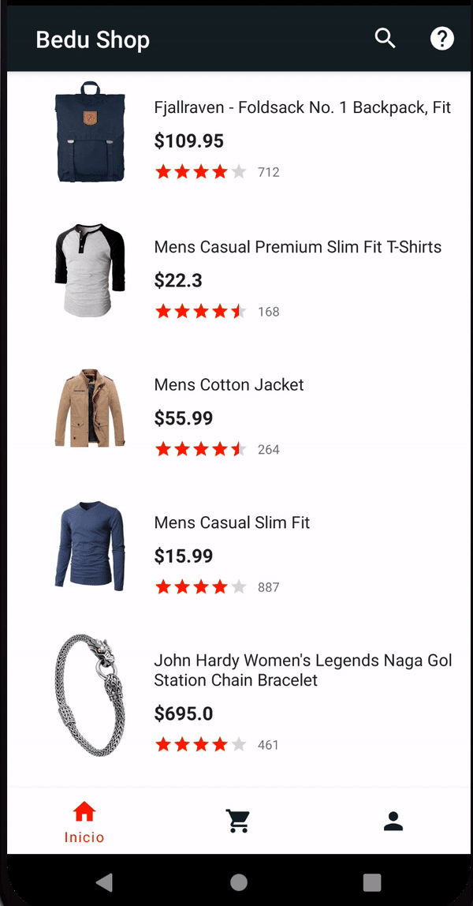

[`Kotlin Intermedio`](../../Readme.md) > [`Sesión 07`](../Readme.md) > `Proyecto`

## Proyecto: Menus y RecyclerView

> 

### 1. Objetivos :dart:

- Implementar el uso de Menús en nuestro Action Bar.

### 2. Requisitos :clipboard:

1. Android Studio Instalado en nuestra computadora.

### 3. Desarrollo :computer:

En el desarrollo del siguiente ejercicio, implementaremos las siguientes opciones sobre nuestro Action Bar:

* Opción de búsqueda, cuya funcionalidad se limite a mostrar un Toast alegando que la funcionalidad no está disponible por el momento.
* Opción de ayuda, que tiene el propósito de redireccionarnos al sitio web oficial de bedu, en el apartado de blog.

La implementación de las opciones dentro de la barra deben verse de la siguiente forma:

Recordemos que la barra no está disponible para las pantallas de login ni de registro.

#### Resultado

A continuación se muestra cómo debe verse la barra, así como la visualización del comportamiento de cada uno de estos. No es necesario crear un nuevo *Activity* o *Fragment* para realizar la navegación, es suficiente con que el navegador nos direccione al sitio web. 

### Recursos

* Sitio web de la ayuda: https://www.bedu.org
* Nuevamente, los íconos los obtenemos mediante un *Vector Asset*.

[`Anterior`](../Reto-03/Readme.md) | [`Siguiente`](../Readme.md)

